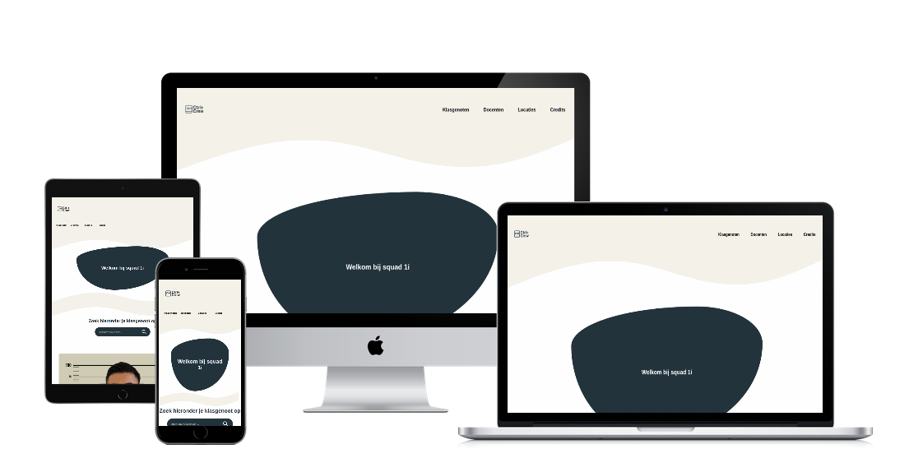
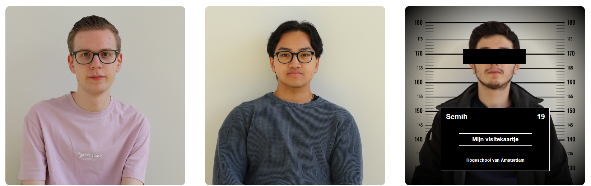
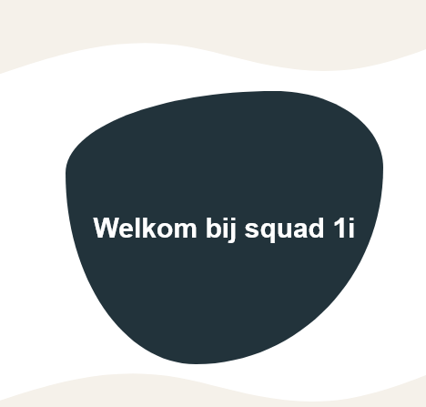
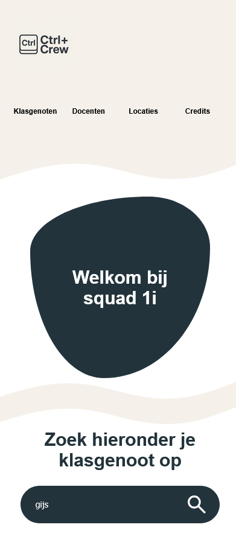

# Squad page 1I 
Voor de opdracht Squad page hebben wij, de CTRL+Crew, een website ontworpen en gemaakt voor squad 1i.
In deze readme presenteren wij ons gemaakte werk.

# Beschrijving

Bekijk de website via deze link: edu.nl/quwey
of bekijk hem snel via de QR code op je mobiel 

# Gebruik
*header*
In de header vind je het logo van ons team terug en een navigatie die je naar de verschillende onderdelen van onze website brengt. De navigatie-items hebben allemaal een hover voor interactie.

*Welkom*
De hero bestaat uit een titel die bezoekers op de website welkom heet, met daaronder een kleine introductie tot de website. Als je over de welkom-blob hovert, maakt hij een leuke beweging.

*zoekfuncite*
De zoekfunctie is bedoeld om snel de gewenste klasgenoot op te zoeken en zo meer informatie over deze persoon te vinden, inclusief een link naar het visitekaartje van deze persoon.
De zoekfunctie is niet hoofdlettergevoelig voor makkelijk gebruik.

Als je niet op naam wilt zoeken, zie je op desktop in eerste instantie vier afbeeldingen met daaronder een knop “meer”. Deze heeft een animatie als je eroverheen hovert en wanneer je erop klikt worden alle studenten van squad 1I getoond. De knop verandert dan naar “minder” om de lijst weer in te klappen.

*mugshtos*
Alle kaartjes van de studenten hebben een leuke interactie. Als je eroverheen hovert, verschijnen er hoogtelijnen achter de student en een bordje met naam, leeftijd en een link naar het visitekaartje dat deze persoon heeft gemaakt. ook komt er een zwart balkje voor de ogen. 

*Docenten*
Onder de studenten hebben we ook alle docenten weergegeven met een hover effect.

*Locaties op de HVA*
Hier worden verschillende locaties op de hva laten zien als je er overheen hovert word er meer informatie getoont over de getooonde plek.
# Drie dingen waar we trots op zijn
1. Zoekfunctie

2. De mugshot hovers 

3. blob

# Het team
Deze website is gemaakt door Gijs Nagtegaal en Roxy Fokker.
https://github.com/gijscreator
https://github.com/Rox-Codelabs

De zoekfunctie in javascript is gemaak door Semih https://github.com/Hexterty46

Onze breakdown schets en ontwerp kun je vinden in de issues van deze repo

De instructie van deze leertaak staan in de [INSTRUCTIONS](https://github.com/fdnd-task/your-tribe-squad-page/blob/main/docs/INSTRUCTIONS.md)

## Licentie

This project is licensed under the terms of the [MIT license](./LICENSE).
